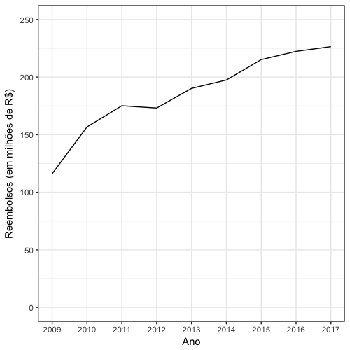

# Descrição

Este é um pacote do R com os pedidos de reembolso dos deputados federais brasileiros entre 2009 e 2019. Possui um data frame com 3.099.310 linhas e 29 colunas. Cada linha equivale a um pedido de reembolso.

# Instalação

Infelizmente, o github limita a hospedagem de arquivos em seu servidores a 100MB. Desta forma, este pacote não pode mais ser instalado utilizando como no passado. Por isso, é necessário seguir os passos a seguir para a sua instalação. É uma instalação feita em duas etapas. A primeira instala o pacote em si, com os dados para o ano de 2019. A segunda etapa baixa os dados adicionais, dando acesso a todos os anos da base de dados. 

Basta rodar

    devtools::install_github("mnunes/reembolsos")
    
desde que o pacote `devtools` esteja instalado em seu R. Se o comando acima não funcionar, instale o pacote `devtools` através do comando

    install.packages("devtools")
    
Após a instalação do pacote `devtools`, rode `devtools::install_github("mnunes/reembolsos")` novamente.

Neste ponto, o pacote estará instalado apenas com o conjunto de dados `camara_mini`, que possui apenas os dados referentes a 2019. Para baixar o conjunto de dados completo, rode os comandos

    library(reembolsos)
    completar()

O R vai começar a baixar o conjunto de dados completo, exibindo o progresso da instalação. Com os dados completos baixados, basta rodar `data(camara)` para ter acesso a eles. Acesse o help do conjunto de dados rodando `?camara`.

# Exemplos de utilização

Que tal verificar quanto dinheiro o Brasil está reembolsando anualmente para os deputados federais?

Veja mais exemplos de utilização do pacote no texto [Controle de gastos públicos: como verificar quanto os deputados federais estão gastando](https://marcusnunes.me/posts/controle-de-gastos-publicos-como-verificar-quanto-os-deputados-federais-estao-gastando/).

# To-Do List

O pacote ainda não está completo. É necessário 

* escrever o help em português
* adicionar os dados referentes ao Senado
* escrever o help para os dados do Senado

# Agradecimentos

Este pacote não seria possível sem o [serenata-toolbox](https://github.com/okfn-brasil/serenata-toolbox), módulo feito para python. Eu apenas fiz uma versão dos dados baixados pelo [serenata-toolbox](https://github.com/okfn-brasil/serenata-toolbox) para ser utilizado por quem só trabalha com o R.

