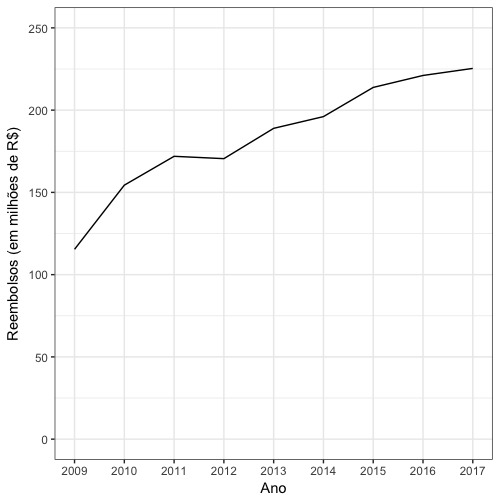

# Descrição

Este é um pacote do R com os pedidos de reembolso dos deputados federais brasileiros entre 2009 e 2017. Possui um data frame com 3.100.697 linhas e 29 colunas. Cada linha equivale a um pedido de reembolso.

# Instalação

Infelizmente, o github limita a hospedagem de arquivos em seu servidores a 100MB. Desta forma, este pacote não pode mais ser instalado utilizando como no passado. Por isso, é necessário seguir os seguintes passos para a sua instalação. Há duas maneira de fazer isso: uma maneira _point and click_ e outra utilizando o terminal. Basta seguir _apenas_ uma delas; não é necessário rodar as duas. Escolha aquela que for mais confortável de acordo com o seu uso computacional.

## Maneira _point and click_

1. Em primeiro lugar, é necessário baixar o zip do pacote. Para isso, clique no link à direita na página, escolhendo a opção **Download ZIP**:

2. Salve o arquivo `reembolsos-master.zip` em seu computador.

3. Extraia o conteúdo do arquivo `reembolsos-master.zip` em uma pasta (por exemplo, em uma pasta chamada `reembolsos-master`.

4. Entre na pasta criada com a extração do arquivo .zip e dê um duplo clique no arquivo `reembolsos.Rproj`. Isto vai abrir o RStudio em seu computador.

5. 

## Usando o terminal    
    
# Exemplos de utilização

Que tal verificar quanto dinheiro o Brasil está reembolsando anualmente para os deputados federais?

Spoiler: foram 225 milhões de reais só em 2017, quase o dobro de 2009.

Veja mais exemplos de utilização do pacote no texto [Verifique os gastos do seu deputado](https://marcusnunes.me/posts/controle-de-gastos-publicos-como-verificar-quanto-os-deputados-federais-estao-gastando/).

# To-Do List

O pacote ainda não está completo. É necessário 

* escrever o help em português
* adicionar os dados referentes ao Senado
* escrever o help para os dados do Senado

# Agradecimentos

Este pacote não seria possível sem o [serenata-toolbox](https://github.com/okfn-brasil/serenata-toolbox), módulo feito para python. Eu apenas fiz uma versão dos dados baixados pelo [serenata-toolbox](https://github.com/okfn-brasil/serenata-toolbox) para ser utilizado por quem trabalha com o R.
